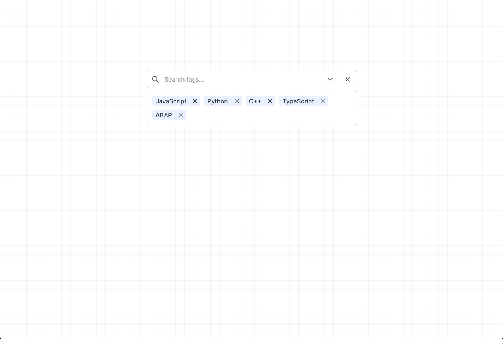

## Multi Select

A multi select component built with ReactJs, TailwindCSS and uses Context API for state management



### Features
1. Clear Selected Options
2. Search Options (Debounced)
3. Set Max Options Limit
4. Keyboard Accessibilty
5. Loading States (Server Side Search)

### Usage

```jsx
<MultiSelect options={[]} selected={[]} />
```

#### Props

```jsx
type Option = { value: string; label: string }
```

| prop                     | types                                       | description                                       |
|--------------------------|---------------------------------------------|---------------------------------------------------|
| options                  | Option[]                                    | An array of options                               |
| selected                 | Option[]                                    | An array of selected options                      |
| max                      | number                                      | Max number of options allowed to be selected      |
| isOptionsLoading         | boolean                                     | Represents loading state of options               |
| isSelectedOptionsLoading | boolean                                     | Represents loading state of selected options      |
| onClear                  | () => void                                  | Clears the selected options                       |
| onSearch                 | (search: string) => void                    | Called on search and passes the searched keywords |
| onSelect                 | (option: Option, options: Option[]) => void | Called whenever an option is selected             |
| onDeselect               | (option: Option, options: Option[]) => void | Called whenever an option is deselected           |
